# 📚 Biblioteca Full Stack

Aplicación web full stack para la gestión de una colección de libros, desarrollada con **SvelteKit** en el frontend y una **API REST construida con Node.js y Express** en el backend. Los datos son almacenados en **MongoDB** mediante **Mongoose**.

La aplicación permite realizar operaciones **CRUD completas** sobre los libros: crear, consultar, actualizar y eliminar registros.

El proyecto integra frontend, backend y base de datos en un flujo completo, permitiendo gestionar la información de forma dinámica y actualizar la interfaz sin necesidad de recargar la página.

## 🎯 Objetivo del proyecto

El objetivo principal fue integrar una API REST desarrollada previamente con Node.js y MongoDB con un frontend moderno construido con **SvelteKit**, comprendiendo el flujo de comunicación entre las diferentes capas de una aplicación web.

Durante el desarrollo se trabajó con:

* 🔗 Consumo de una API REST desde SvelteKit.
* 📡 Comunicación mediante solicitudes HTTP.
* 🗄️ Persistencia de datos utilizando MongoDB y Mongoose.
* 🔄 Implementación del CRUD completo.
* ⚡ Actualización reactiva de la interfaz sin recargar la página.
* 🧩 Comunicación entre componentes mediante props y estado.
* 📱 Diseño responsive para diferentes tamaños de pantalla.
* 🚀 Preparación y despliegue del frontend y backend.

## 🛠️ Tecnologías utilizadas

### Frontend
* **SvelteKit** — desarrollo de la interfaz y gestión de la aplicación.
* **JavaScript** — lógica de la aplicación y comunicación con la API.
* **CSS** — estilos, diseño responsive y presentación de los componentes.
* **Svelte Sonner** — notificaciones visuales para las operaciones CRUD.

### Backend
* **Node.js** — entorno de ejecución del servidor.
* **Express** — creación de la API REST y gestión de rutas.
* **Mongoose** — modelado de datos y comunicación con MongoDB.
* **dotenv** - gestión de variables de entorno y configuración sensible
* **CORS** — permite la comunicación entre el frontend y el backend.

### Base de datos

* **MongoDB Atlas** — almacenamiento persistente de los libros.
* **MongoDB Compass** — visualización y administración de los datos durante el desarrollo.

### Herramientas utilizadas en el proyecto
* **Visual Studio Code** — desarrollo del proyecto.
* **Vite** — herramienta de desarrollo utilizada por SvelteKit.
* **Thunder Client** — pruebas de los endpoints de la API.
* **Git y GitHub** — control de versiones y almacenamiento del código.

## 🌐 Aplicación desplegada

El proyecto cuenta con un frontend y un backend desplegados, permitiendo utilizar la aplicación directamente desde internet.

* 🌐 Frontend: https://biblioteca-fullstack.netlify.app/

* ⚙️ Backend / API REST:https://biblioteca-fullstack-0kjh.onrender.com/books

El frontend se encuentra desplegado en **Netlify**, mientras que el backend está alojado en **Render** y se conecta con MongoDB Atlas para la persistencia de los datos. 


> Los enlaces de producción se agregarán una vez finalizado el despliegue.

## 💻 Vista Principal
La interfaz principal de la aplicación presenta la colección de libros registrados en una cuadrícula de tarjetas. Cada una muestra información relevante como el título,autor,género y fecha de publicación, además de las acciones disponibles para  editar o eliminar el libro. En la parte del header viene un botón donde nos da la opción de agregar nuestro libro favorito.

La interfaz fue desarrollada con SvelteKit y actualiza la información de forma dinámica al realizar operaciones CRUD, sin necesidad de recargar la página.

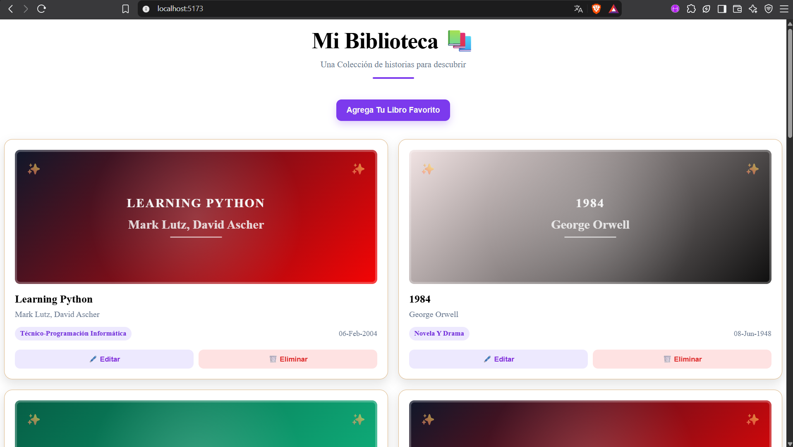

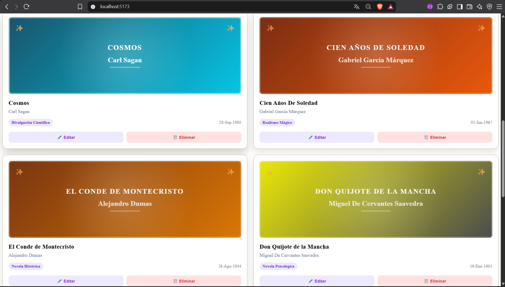

## ➕ Agregar un libro a nuestra biblioteca
El formulario permite generar nuevos libros desde la interfaz de la aplicación.Los datos ingresados son enviados mediante una solicitud POST a la API REST, donde son procesados y almacenados en MongoDB, aquí se diseñamos la ventana modal que se dispara cuando el usuario presiona en agregar libro hicimos el efecto esmerilado(Glassmorphism) como actualmente son las interfaces modernas usando CSS y Svelte.

Una vez completada la operación, la nueva información se refleja inmediatamente en la interfaz y se muestra una notificación confirmando el registro usando svelte-sonner.

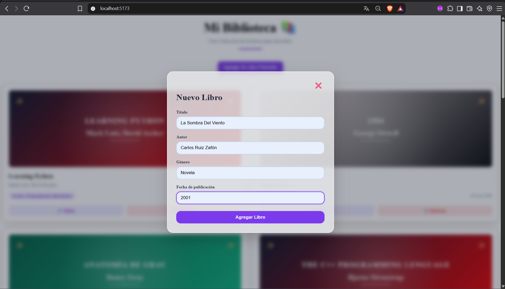

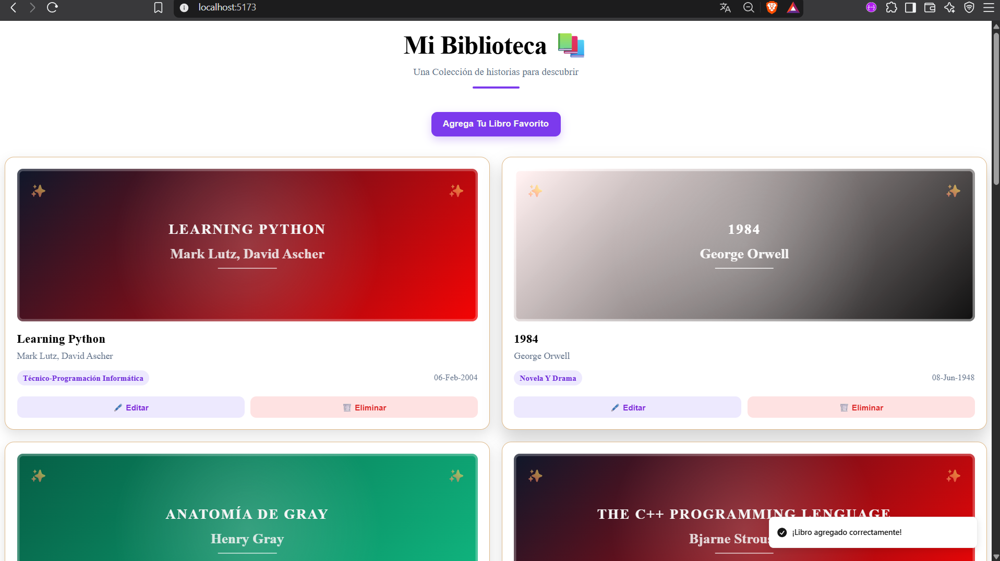

libro agregado en la interfaz automáticamente sin recargar la página usando la reactividad que tiene Svelte

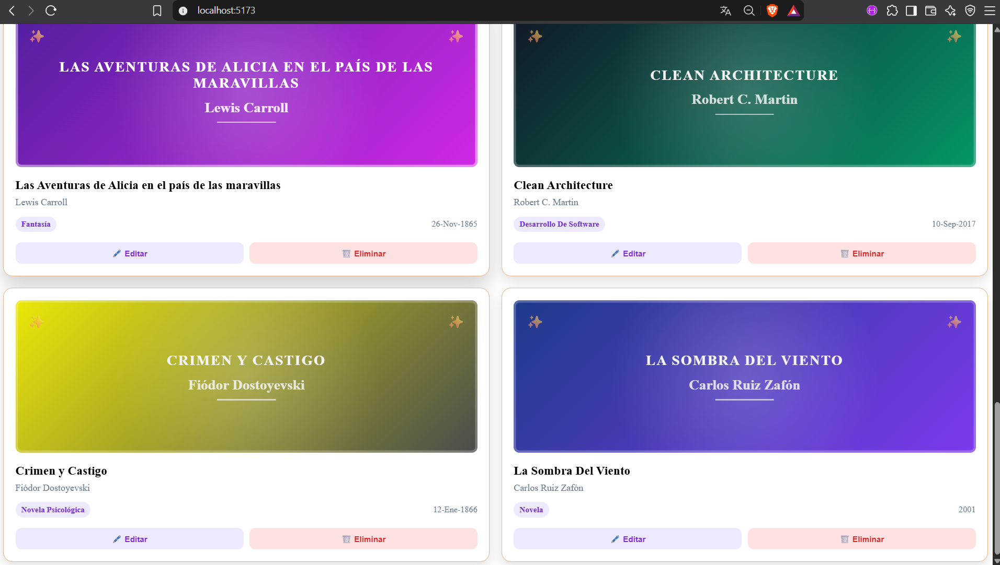

## ⏳ Estado de carga
Durante la obtención de los libros desde la API, la aplicación muestra un estado de carga para indicar al usuario que la información está siendo procesada.

Este estado se controla mediante el estado reactivo de SvelteKit y desaparece automáticamente cuando finaliza la solicitud al backend además vemos que construimos una interfaz aplicando un efecto de animación escalonada para que no se muestren los libros de golpe con la animación se empiezan a mostrar uno por uno en diferentes lapsos de tiempo muy rápidamente como se puede ver a continuación:

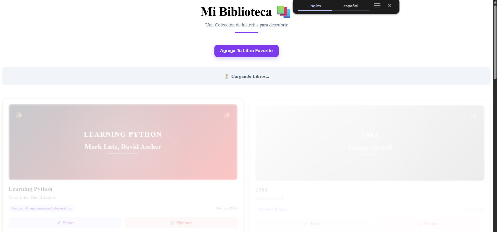

## ⚠️ Manejo de errores
La aplicación contempla errores durante la comunicación con la API. Si el backend no está disponible o ocurre un problema durante una solicitud, la interfaz informa al usuario mediante un mensaje de error.

Esto permite manejar de forma controlada los problemas de comunicación sin dejar la aplicación en un estado inesperado.

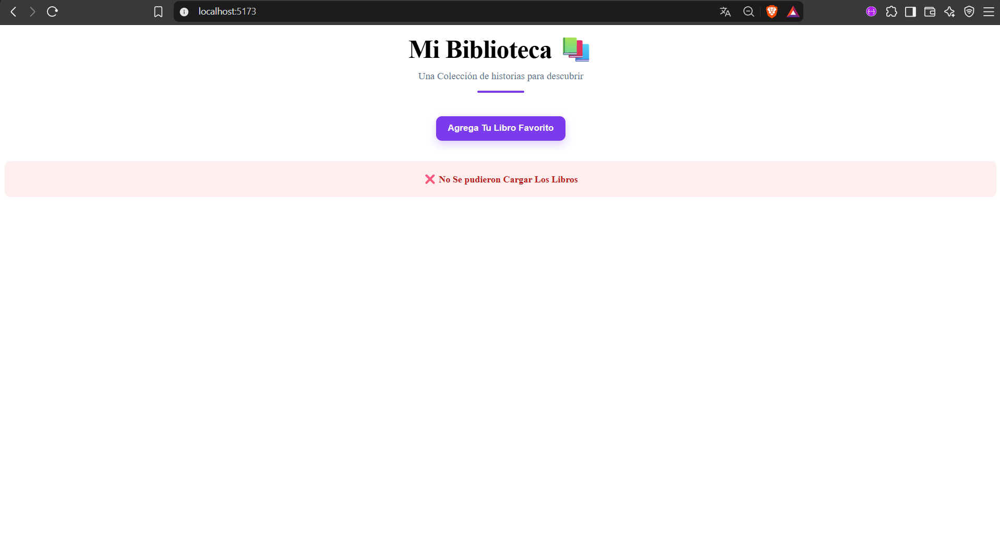

## ✍️ Editar un libro
El mismo formulario utilizado para registrar libros también se reutiliza para editar libros existentes.Al seleccionar un libro, sus datos son cargados automáticamente en el formulario para poder modificarlos.

Al guardar los cambios, el frontend envía una solicitud PUT a la API REST y actualiza la información mostrada en la interfaz sin necesidad de recargar la página.

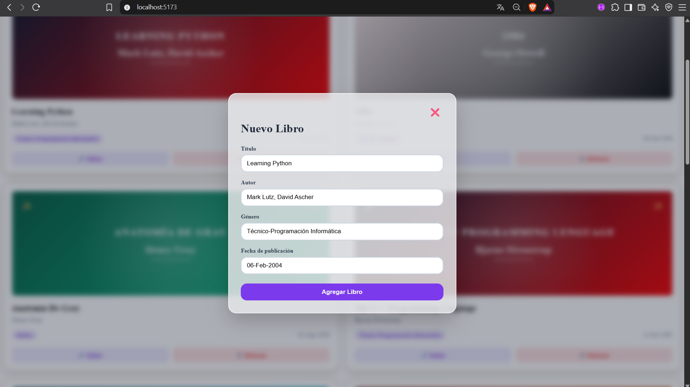

## 📱 Diseño responsive 
La interfaz está adaptada para diferentes tamaños de pantalla mediante CSS responsive. En dispositivos móviles, las tarjetas de libros se reorganizan en una sola columna para facilitar la lectura y navegación.

El diseño mantiene una estructura clara y usable tanto en pantallas de escritorio como en dispositivos móviles.

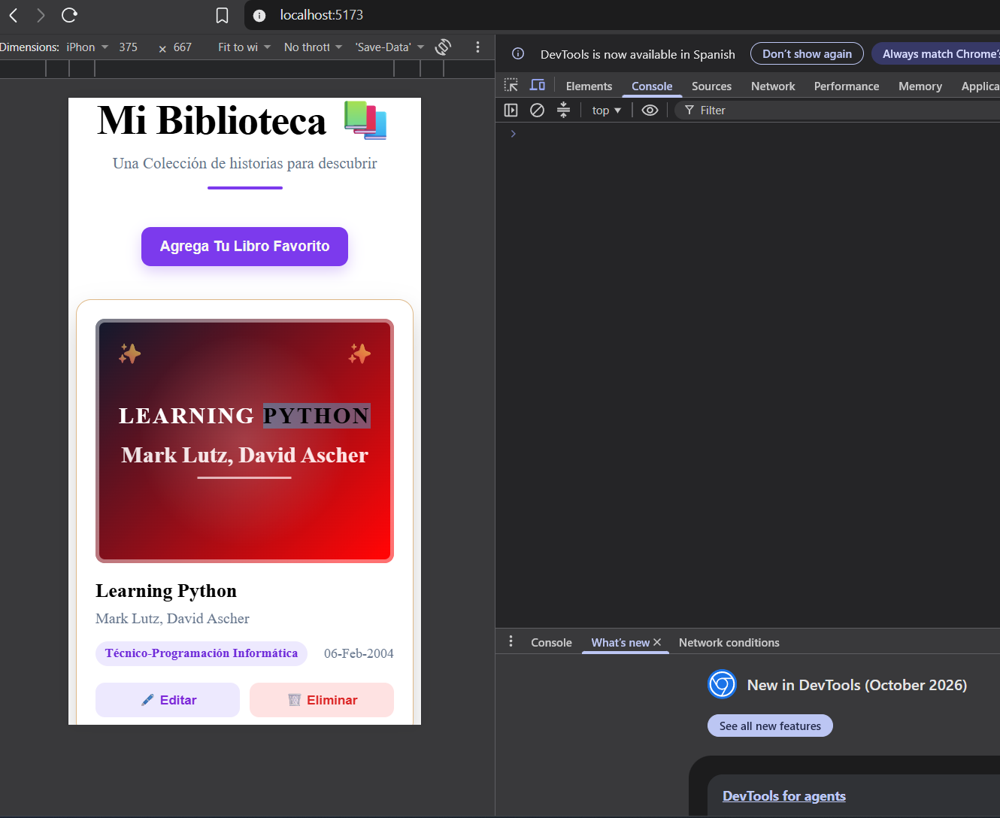

## ⚙️ Estructura del backend
El backend está organizado siguiendo una estructura sencilla y modular. Las rutas de la API se encuentran separadas de los modelos de datos , mientras que app.js se encarga de configurar el servidor, conectar la aplicación con MongoDB y registrar las rutas.

Esta separación permite mantener una estructura clara y facilitar el mantenimiento de cada parte de la API.

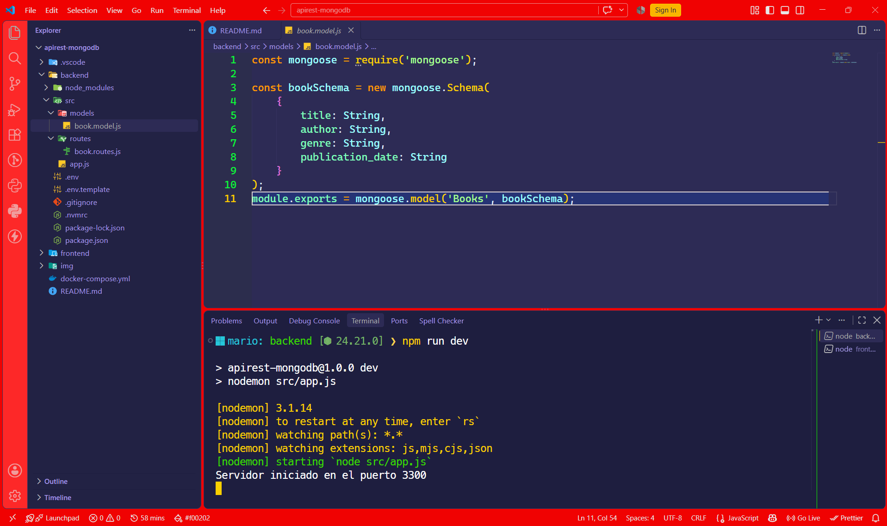

## 🔁 API REST y operaciones CRUD
La API REST permite gestionar los libros mediante diferentes métodos HTTP.El backend implementa las operaciones necesarias para consultar, crear, actualizar y eliminar registros.

Las solicitudes son procesadas mediante Express y los datos son gestionados utilizando Mongoose para comunicarse con MongoDB.

Las principales operaciones disponibles son:

* `GET` --Obtener los libros. 
* `POST` --Crea un nuevo libro. 
* `PUT` --Actualiza un libro existente. 
* `PATCH` --Actualiza parcialmente un libro.
* `DELETE` --Elimina un libro.

Vemos nuestra petición POST funcionado correctamente a través de Thunder Client

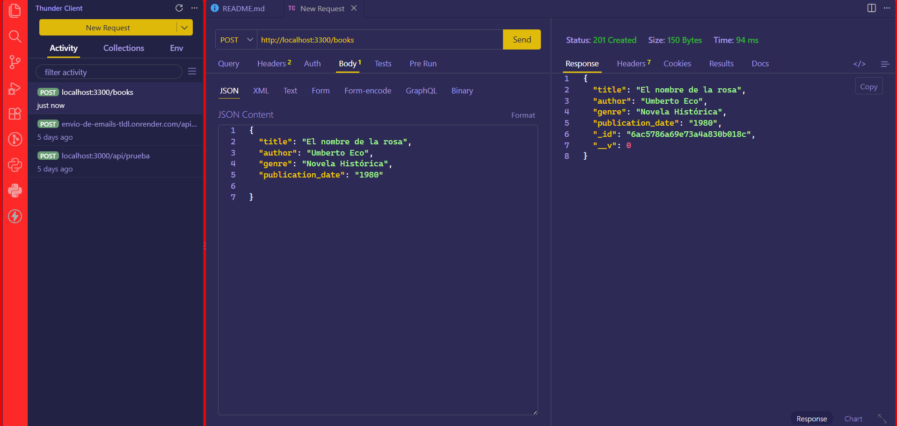

Verificamos que se agregara correctamente el libro que creamos a través de una petición GET al servidor de la api como se muestra a continuación:

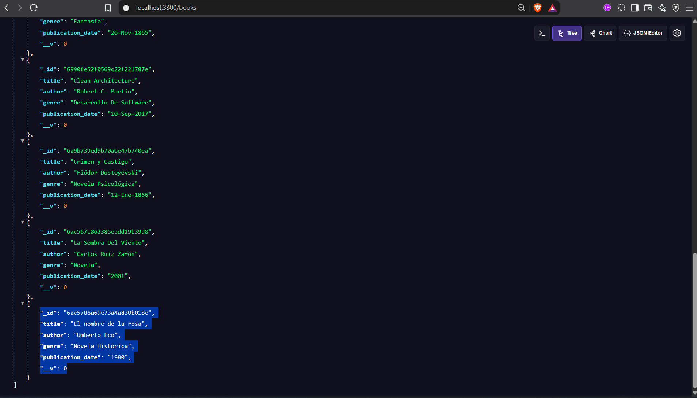

## 🗄️ Persistencia de datos con MongoDB

Los libros registrados mediante la API se almacenan en MongoDB, utilizando Mongoose como ODM para definir el modelo y gestionar la comunicación con la base de datos, MongoDB Atlas permite mantener los datos persistentes, mientras que MongoDB Compass facilita la visualización y administración de los documentos almacenados, A continuación podemos ver nuestra base de datos con los libros que se han registrados:

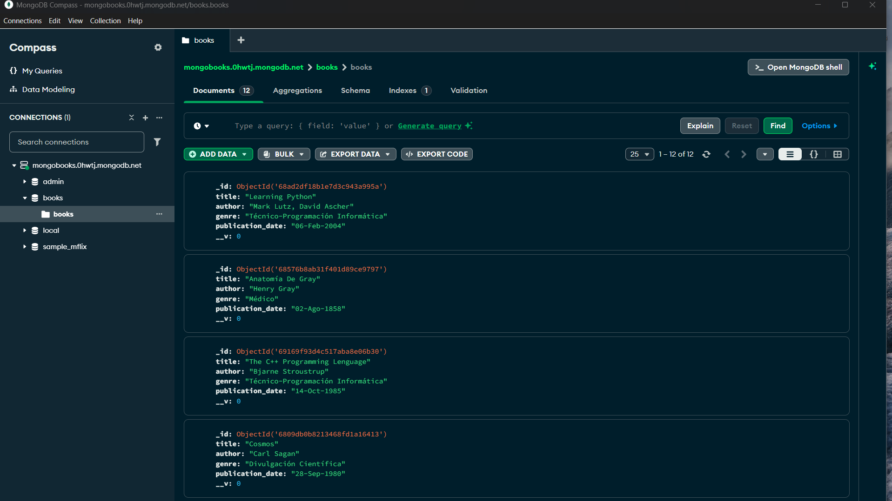

## Arquitectura del proyecto

El proyecto está dividido en tres capas principales:
```text
┌─────────────────────────────┐
│          Frontend           │
│          SvelteKit          │
│                             │
│  Interfaz + lógica CRUD     │
└──────────────┬──────────────┘
               │
               │ HTTP / REST
               ▼
┌─────────────────────────────┐
│           Backend           │
│       Node.js + Express     │
│                             │
│        API REST / CRUD      │
└──────────────┬──────────────┘
               │
               │ Mongoose
               ▼
┌─────────────────────────────┐
│          MongoDB            │
│         Atlas + DB          │
│                             │
│       Datos de libros       │
└─────────────────────────────┘
```

El **frontend** consume la API REST mediante solicitudes HTTP. El **backend** recibe y procesa estas solicitudes utilizando Express y Mongoose, mientras que **MongoDB Atlas** se encarga de almacenar los datos de forma persistente.Esta separación permite mantener cada parte del proyecto organizada y facilita su mantenimiento y despliegue.

## 🔌 Endpoints de la API

La API REST proporciona los siguientes endpoints para gestionar los libros:

| Método   | Endpoint     | Descripción                      |
| -------- | ------------ | -------------------------------- |
| `GET`    | `/books`     | Obtener todos los libros         |
| `POST`   | `/books`     | Crear un nuevo libro             |
| `GET`    | `/books/:id` | Obtener un libro por su ID       |
| `PUT`    | `/books/:id` | Actualizar un libro completo     |
| `PATCH`  | `/books/:id` | Actualizar parcialmente un libro |
| `DELETE` | `/books/:id` | Eliminar un libro                |

Todas las operaciones utilizan **JSON** para el intercambio de información entre el frontend y el backend.

## ⚙️ Instalación y ejecución

En esta parte vamos a explicar como se debe instalar y ejecutar el proyecto por si queremos hacer lo funcionar mediante este repositorio:

### 1. Clonar el repositorio
```bash
    git clone https://github.com/MarioMartinezAguilar/biblioteca-fullstack
    cd biblioteca-fullstack
```

### 2. Instalar dependencias del backend
```bash
    cd backend
    npm install
```

### 3. Configurar las variables de entorno

Crear un archivo `.env` dentro de la carpeta `backend` con las variables necesarias para la conexión con MongoDB.
```env
    MONGO_URL=tu_url_de_mongodb
    MONGO_DB_NAME=nombre_de_tu_base_de_datos
    PORT=3300
```

### 4. Iniciar el backend
```bash
    npm start
```
El servidor estará disponible en:
```text
    http://localhost:3300
```

### 5. Instalar dependencias del frontend
En otra terminal:
```bash
    cd frontend
    npm install
```

### 6. Iniciar el frontend
```bash
    npm run dev
```

SvelteKit mostrará en la terminal la dirección local para acceder a la aplicación.

## ## 🔐 Explicación detallada de las variables de entorno

El backend utiliza variables de entorno para mantener fuera del código fuente la información de configuración y las credenciales de acceso a MongoDB.

Dentro de `backend/` se debe crear un archivo `.env` con la siguiente estructura:
```env
    MONGO_URL=tu_url_de_mongodb
    MONGO_DB_NAME=nombre_de_tu_base_de_datos
    PORT=3300
```

| Variable        | Descripción                                             |
| --------------- | ------------------------------------------------------- |
| `MONGO_URL`     | URL de conexión a MongoDB Atlas.                        |
| `MONGO_DB_NAME` | Nombre de la base de datos utilizada por la aplicación. |
| `PORT`          | Puerto en el que se ejecuta el servidor backend.        |

> ⚠️ El archivo `.env` contiene información sensible y no debe subirse al repositorio. El proyecto incluye un archivo `.env.template` como referencia para configurar las variables necesarias.

Resultado Esperado del proyecto

El proyecto finaliza con un CRUD completo y funcional, donde el usuario puede crear, consultar, editar y eliminar libros desde la interfaz de SvelteKit.Cada operación se comunica con la API REST y los cambios se almacenan de forma persistente en MongoDB, completando el flujo:

**Frontend → API REST → MongoDB**

## 👨‍💻 Autor del proyecto

## **Mario Martinez Aguilar**


